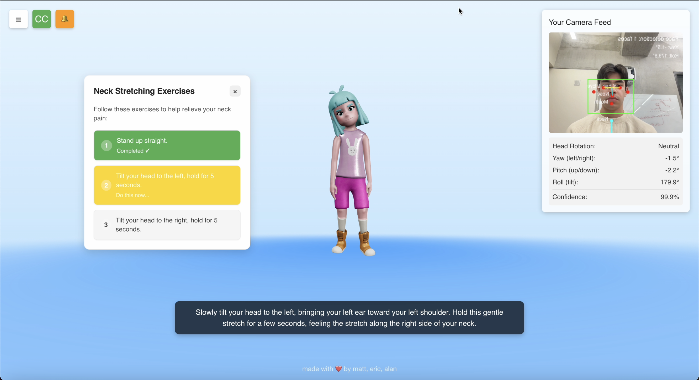

# Rekovery: AI-Powered Virtual Physiotherapist

Rekovery is an innovative virtual physiotherapy application that combines AI, speech recognition, and pose detection to provide personalized physical therapy exercises. The application features a 3D avatar that guides users through customized exercises based on their specific needs and tracks their progress in real-time.



## Features

- **Interactive 3D Physiotherapist Avatar**: Demonstrates exercises with realistic movements
- **Voice-Based Consultation**: Users can describe their pain or issues through voice interaction
- **Real-time Pose Detection**: Monitors user posture and movement during exercises
- **Personalized Exercise Plans**: Generates customized treatment plans using AI
- **Voice Guidance**: Provides audio instructions with high-quality text-to-speech
- **Exercise Tracking**: Monitors progress and provides feedback during exercises
- **Conversation History**: Saves past sessions for reference

## Tech Stack

### Frontend
- React.js 19.0.0
- Three.js with @react-three/fiber for 3D rendering
- TensorFlow.js for pose detection
- Socket.io for real-time communication
- Tailwind CSS for styling

### Backend
- Flask web server
- Flask-SocketIO for WebSocket support
- Google's Gemini AI for generating personalized exercises
- ElevenLabs for high-quality speech synthesis

## Project Structure

```
├── backend/                  # Flask backend server
│   ├── app.py                # Main Flask application
│   ├── helpers.py            # Utility functions
│   └── requirements.txt      # Python dependencies
│
└── frontend/                 # React frontend application
    └── virtual-physiotherapist/
        ├── public/           # Static assets
        │   ├── animations/   # 3D model animations
        │   └── audio/        # Pre-recorded audio files
        └── src/
            ├── components/   # React components
            ├── services/     # API and service integrations
            └── App.js        # Main application component
```

## Setup and Installation

### Prerequisites
- Node.js (v18 or higher)
- Python (v3.10 or higher)
- NPM or Yarn
- Git

### Backend Setup

1. Clone the repository:
   ```bash
   git clone https://github.com/yourusername/genai-genesis-physio.git
   cd genai-genesis-physio
   ```

2. Set up the Python environment:
   ```bash
   cd backend
   python -m venv venv
   source venv/bin/activate  # On Windows: venv\Scripts\activate
   pip install -r requirements.txt
   ```

3. Set up environment variables (create a `.env` file in the backend directory):
   ```
   GEMINI_API_KEY=your_gemini_api_key
   ELEVEN_LABS_API_KEY=your_eleven_labs_api_key
   SECRET_KEY=your_secret_key_for_flask
   ```

4. Start the backend server:
   ```bash
   python app.py
   ```
   The server will run on http://localhost:8000

### Frontend Setup

1. Navigate to the frontend directory:
   ```bash
   cd ../frontend/virtual-physiotherapist
   ```

2. Install dependencies:
   ```bash
   npm install
   ```

3. Set up environment variables (create a `.env` file in the frontend directory):
   ```
   REACT_APP_OPENAI_API_KEY=your_openai_api_key
   REACT_APP_ELEVENLABS_API_KEY=your_eleven_labs_api_key
   ```

4. Start the development server:
   ```bash
   npm start
   ```
   The application will open in your browser at http://localhost:3000

## Using the Application

1. **Initial Consultation**: When the application loads, the virtual physiotherapist will greet you and ask about your condition.

2. **Describe Your Condition**: Answer the physiotherapist's questions about:
   - The area of pain/discomfort
   - The severity and type of pain
   - Activities that trigger or worsen the pain

3. **Treatment Plan**: The AI will generate a personalized exercise plan based on your responses.

4. **Exercise Guidance**: The 3D avatar will demonstrate each exercise while providing audio instructions.

5. **Real-time Feedback**: The application will track your movements through your camera and provide feedback on your form.

6. **Progress Tracking**: Complete the recommended exercises and receive feedback on your performance.

## Environment Variables

### Backend
- `GEMINI_API_KEY`: API key for Google's Gemini AI
- `ELEVEN_LABS_API_KEY`: API key for ElevenLabs text-to-speech
- `SECRET_KEY`: Secret key for Flask sessions

### Frontend
- `REACT_APP_OPENAI_API_KEY`: API key for OpenAI (used for speech recognition)
- `REACT_APP_ELEVENLABS_API_KEY`: API key for ElevenLabs text-to-speech

## Development Notes

- The 3D model and animations need to be placed in the `public` directory
- The application requires camera access for pose detection
- The application uses WebSockets for real-time communication between the frontend and backend

## Contributing

Contributions are welcome! Please feel free to submit a Pull Request.

## License

This project is licensed under the MIT License - see the [LICENSE](LICENSE) file for details.

## Acknowledgements

- This project was created for GenAI Genesis 2025
- Thanks to all contributors who participated in the development
